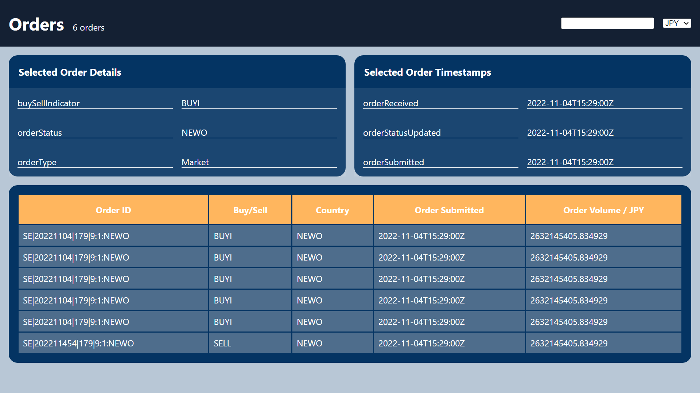

# NOTE:

- All questions done.

- Here, is the visual representation of my final dashboard --> './Dashboard_Aparajit.png'  

## Steps to run:

- npm install > npm start

### Additional:

- By Aparajit Sharan (CSE)